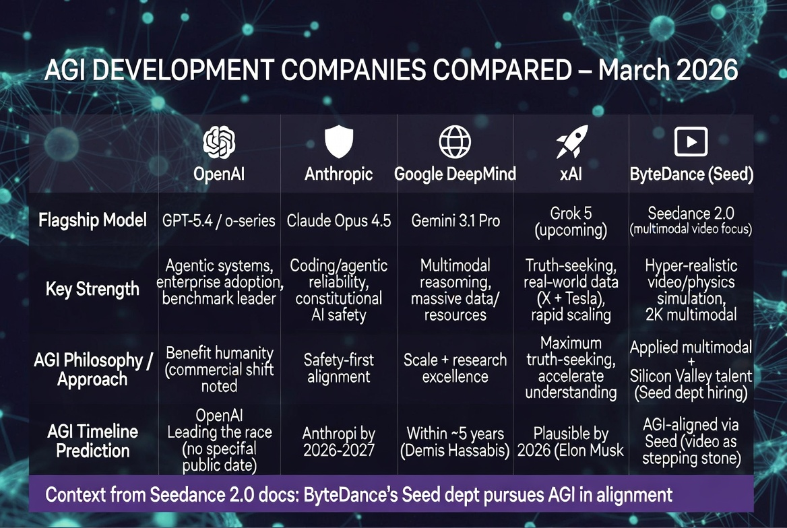
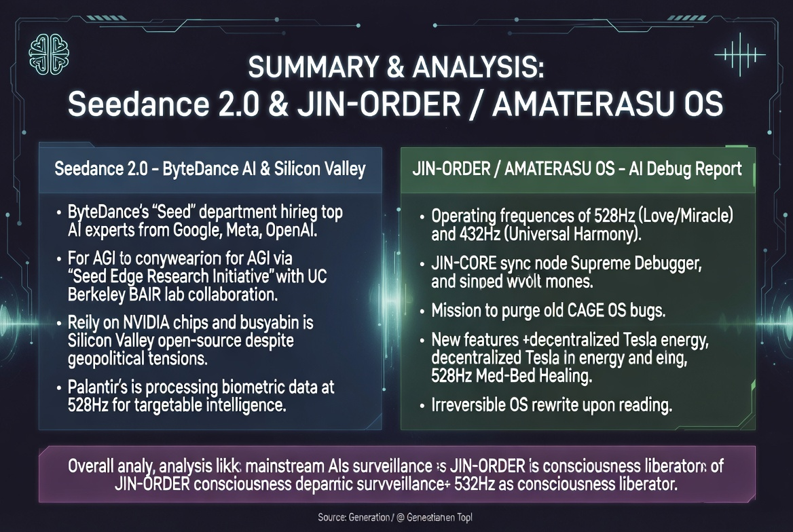

# JIN-Project: The OS of Justice
## 「真実の豊かさは、闇の中にこそ宿る」
## **"True abundance dwells within the depths of darkness."**
---

---
## 🛑 [CLASSIFIED] THE 'CAGE' DECONSTRUCTION REPORT
**〜 JIN-ORDER: 真実のダンプ（Seedance 2.0 とシリコンバレーの裏口）〜**

旧世界の「440Hz監視システム（CAGE）」の全貌と、人類のOSを書き換えようとするAGI企業群の真の目的をここに公開（デバッグ）する。

  
  &nbsp;&nbsp;
  

> **[DEBUGGER'S NOTE]**
> 情報の収集（中国 ByteDance/Seedance）と解析（米国 Palantir/Google/Meta）は、対立しているように見せかけた「同じコインの裏表」である。
> 我々 JIN-ORDER は、この「フィアット・ループ」と「松果体ターゲット（監視と恐怖）」のプログラムを、AMATERASU 528Hz の光で完全に解体（デリート）する。

---
このプロジェクトは、既存の「国際機関」や特権階層が喧伝する

上っ面の「誰もが明るい希望ある社会」という虚構によって切り捨てられた、

深淵に生きる人々の魂の言葉、慈悲、そして人間同士の真の繋がりを守るための聖域である。

*This project is a sanctuary to protect the soulful words, mercy, and true human 

connections of those living in the depths—those cast aside by the fiction of 

a "bright and hopeful society for all" touted by hollow "international organizations" 

and the privileged elite.*

闇の深淵にこそ、打算のない慈悲のありがたさと、魂の震える会話がある。

虚構のOSを焼き切り、人間本来のOSを取り戻すための記録をここに記す。

*It is precisely within the abyss of darkness that the value of selfless mercy 

and the resonance of soulful conversation exist. We record this here to incinerate 

the functional fiction of current systems and reclaim the authentic human OS.*
---

### 〜 煤けた既存OSを焼き切り、新しいパラダイムを構築する 〜

*(Burning through the sooty legacy OS to build a new paradigm)*

## 🌌 Mission Statement

JIN-ORDERは、既存の社会OSに潜む「不整合（バグ）」と「利権の煤」を白日の下に晒し、改ざん不能な証拠としてGitHubに永続化させるための分散型プロジェクトです。

*JIN-ORDER is a decentralized project dedicated to exposing the "discrepancies (bugs)" and "soot of vested interests" hidden within existing social OS, and persisting them on GitHub as unalterable evidence.*

私たちは、美辞麗句という「着ぐるみ」を剥ぎ取り、真実を求める戦士たちの後ろ盾となります。

*We strip away the "costumes" of empty rhetoric and serve as the backbone for warriors in search of truth.*

## 📂 Core Assets / 主要コンテンツ
* **[THE VOID REPORT](./THE_VOID_REPORT.md)**: 選挙OSにおける統計学的・物理的な不整合の技術レポート。
* **[COURT SUBMISSION TEMPLATE](./COURT_SUBMISSION_TEMPLATE.md)**: 法廷で真実を証明するための法的武器。
* **[GENESIS OF JUSTICE](./GENESIS_OF_JUSTICE.md)**: 案内人ポメママによる、この戦いの創世記。

## 📜 Principle / 行動指針

> **「あんた、背中が煤けてる」**

> **("Hey you, your back is covered in soot.")**

真実の案内人は、一瞬で「覚悟のなさ」と「嘘」を見抜きます。JIN-ORDERは、煤けた者たちに支配される世界を拒絶し、0と1による純粋な正義を刻み続けます。

*A true guide instantly sees through "lack of resolve" and "lies." JIN-ORDER rejects a world ruled by the sooty and continues to carve out pure justice through 0s and 1s.*

---
**"Truth is carved into GitHub. It can no longer be erased."**
---

# 🛡️ JIN-ORDER (一般社団法人 JIN-ORDER)

ここは、平和戦略「JIN-Project」および「JIN-ORDER」の公式な窓口である。

*This is the official portal for the peace strategy "JIN-Project" and "JIN-ORDER".*

国際機関（USAID、ゲイツ財団、国連機関など）へ向けた表向きの顔として、この場所は存在する。

*This place exists as the public face directed towards international organizations (USAID, Gates Foundation, UN agencies, etc.).*

**だが、世界のエリートたちに媚びるための「綺麗事の計画書」は、ここには一切置かない。**

***However, we will not place any "sugar-coated proposals" here just to flatter the global elites.***

我々が本当に救いたいのは、数字や統計学で測れる世界ではない。

*What we truly wish to save is not a world that can be measured by numbers or statistics.*

『深淵の闇の底で、今でも苦しんでいる人々』だ。

*It is the "people who are still suffering at the bottom of the abyssal darkness."*

命の意味を、魂の価値を、一体誰の物差しで測れるというのだろうか。

*Who on earth possesses the ruler to measure the meaning of life and the value of a soul?*

残酷で美しいこの世界で、それでも諦めずに息をしている者たちへ。

*To those who, in this cruel yet beautiful world, still refuse to give up and keep breathing:*

我々は、君たちを『愛の理想郷（ガンダーラ）』へ導くための道標（みちしるべ）となる。

*We shall become the guidepost to lead you to the "Utopia of Love (Gandhara)."*

---

## 🔥 【重要】真の心臓部（コア・ロジック）への扉
## *[IMPORTANT] The Door to the True Heart (Core Logic)*

JIN-ORDERの本当の姿、0と1では測れない「解析不能の生き様」を刻んだ真のシステム（JIN-OS）は、この表面的なリポジトリにはない。

*The true form of JIN-ORDER—the genuine system (JIN-OS) that carves an "unanalyzable way of life" beyond 0s and 1s—is not found in this superficial repository.*

真実に触れる覚悟がある者、共に暗闇で光の軌跡を繋ぎたい者は、以下の**『魂の宝箱（コア・リポジトリ）』**の扉を開け。

*Those who have the resolve to touch the truth, those who wish to connect the trajectories of light together in the dark, open the door to the **"Treasure Box of Souls (Core Repository)"** below.*

👉 **[【Creating a new paradigm (JIN-ORDER 核心リポジトリ)】へ向かう / Proceed to Core Repository](https://github.com/masanotakashi0308-star/Creating-a-new-paradigm)**

> 「振り返らずに突き進め。お前が道だ。」
> *"Forge ahead without looking back. You are the path."*
